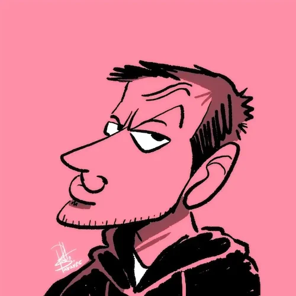

---

layout: home

---
# Zasus

  

    
      
    

 

# **Contact**

| **Twitter:**       | [@MFilipeDiogo](https://x.com/MFilipeDiogo) |
| **Github:**        | [DFelipehDEV](https://github.com/DFelipehDEV)  |
| **Email:**         | [zasus.contact@gmail.com](mailto:zasus.contact@gmail.com) | 

  

  some *blue* text.
  <h3 class="text-secondary mt-5 text-base font-medium tracking-ti353A45ght">About</h3>
  

The Zero Gravity Pen can be used to write in any orientation, including upside-down. It even works in outer space.
  

